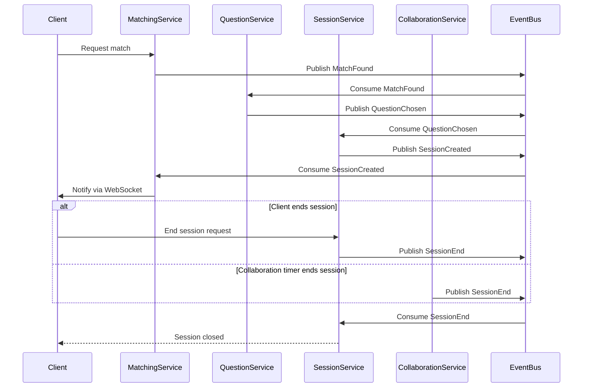

```mermaid
sequenceDiagram
    participant Client
    participant MatchingService
    participant QuestionService
    participant SessionService
    participant CollaborationService
    participant EventBus

    %% Start: client request triggers matching
    Client->>MatchingService: Request match
    MatchingService->>EventBus: Publish MatchFound
    EventBus->>QuestionService: Consume MatchFound
    QuestionService->>EventBus: Publish QuestionChosen
    EventBus->>SessionService: Consume QuestionChosen
    SessionService->>EventBus: Publish SessionCreated
    EventBus->>MatchingService: Consume SessionCreated
    MatchingService->>Client: Notify via WebSocket

    %% Session is active on client

    alt Client ends session
        Client->>SessionService: End session request
        SessionService->>EventBus: Publish SessionEnd
    else Collaboration timer ends session
        CollaborationService->>EventBus: Publish SessionEnd
    end

    EventBus->>SessionService: Consume SessionEnd
    SessionService-->>Client: Session closed

```
