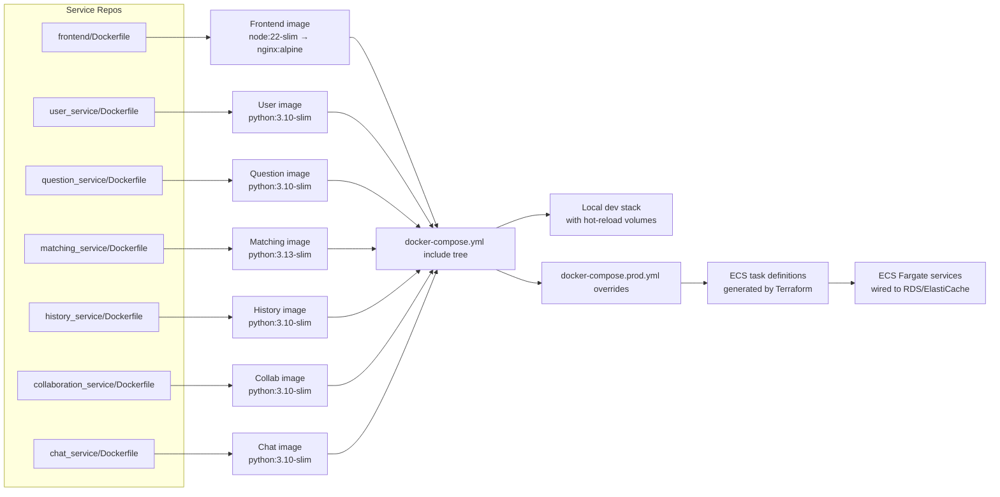
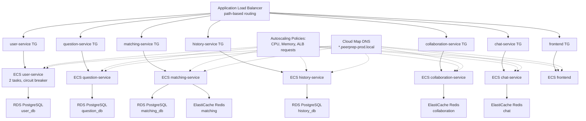
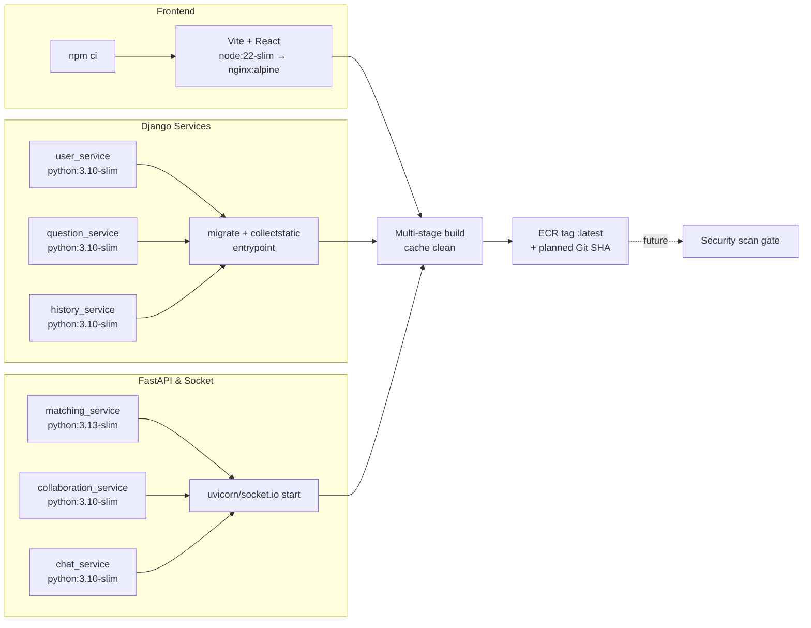
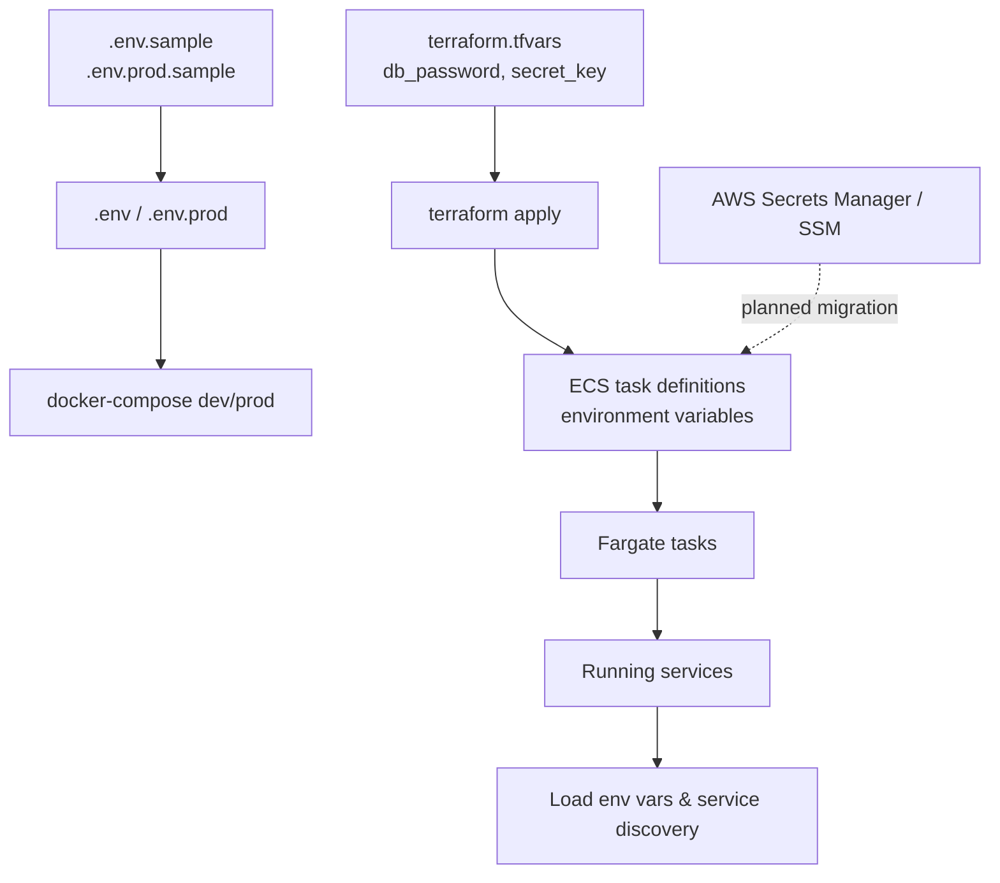
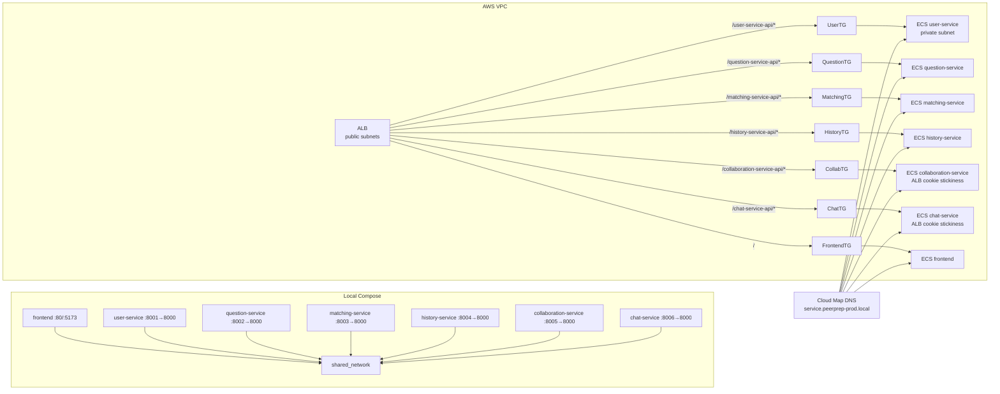
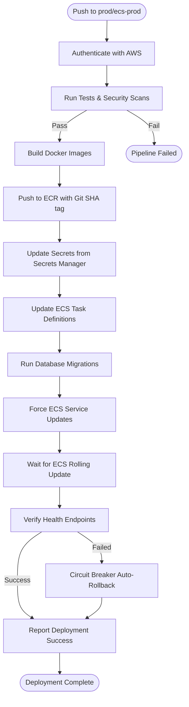
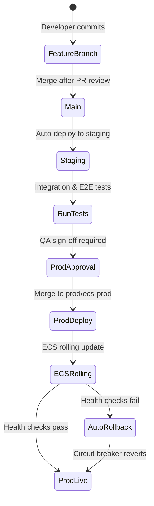
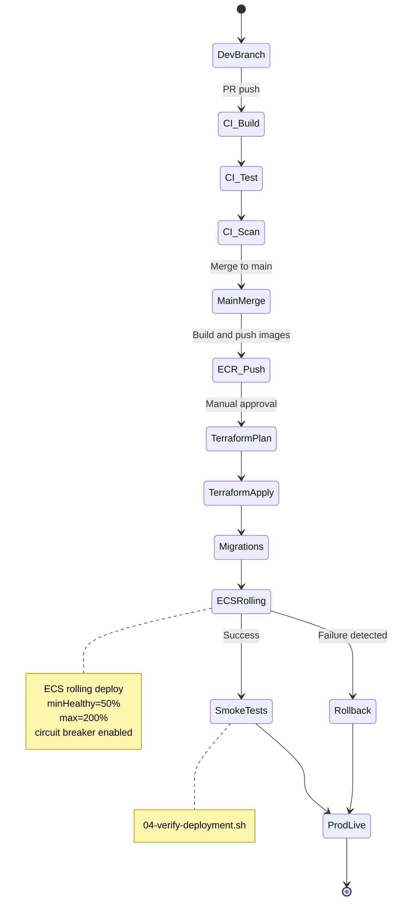
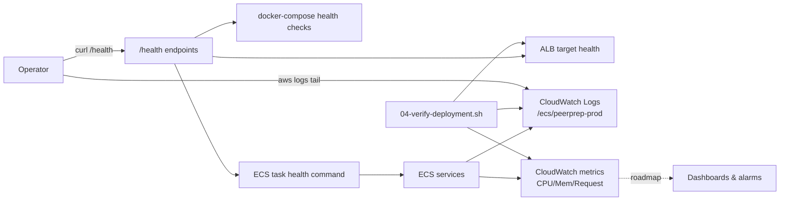

# Service Containerization (Implementation & Deployment Decisions)

- can visualise with https://stackedit.io/app#

Some of these decisions depend on the chosen nice-to-have categories, but the current plan already covers the must-have scope below.

---

## Table of Contents

1. [Chosen Approach to Containerize Must-Have Services](#chosen-approach-to-containerize-must-have-services)
2. [Deployment Workflow and CI/CD Considerations](#deployment-workflow-and-cicd-considerations)
3. [Alignment with Scalability and Production Readiness](#alignment-with-scalability-and-production-readiness)
4. [Implementation Tech Stack](#implementation-tech-stack)
5. [Configuration and Secrets Management](#configuration-and-secrets-management)
6. [Networking and Ingress](#networking-and-ingress)
7. [CI/CD and Rollout Strategy](#cicd-and-rollout-strategy)
8. [Observability, Health Checks, and Alerts](#observability-health-checks-and-alerts)

---

## Chosen Approach to Containerize Must-Have Services

  

All seven must-have services (frontend, user, question, matching, history, collaboration, chat) keep a dedicated Dockerfile and standalone `docker-compose.yml`. The root-level `docker-compose.yml` simply includes each sub-service so local developers can spin up the entire stack, while `docker-compose.prod.yml` removes the local Postgres/Redis sidecars and expects Terraform-managed RDS/ElastiCache instead. Backends use slim Python bases with an entrypoint that blocks on dependencies, runs migrations, and exposes `/health`. The frontend builds under Node 22 and serves static assets out of an Nginx stage.

  



---

## Deployment Workflow and CI/CD Considerations

The deployment follows an automated pipeline pattern: **build → test → push → deploy → migrate → verify → monitor**. This workflow leverages GitHub Actions for continuous deployment, AWS Systems Manager (SSM) for secure deployments, and AWS Secrets Manager for centralized configuration management.

  

## Alignment with Scalability and Production Readiness

Terraform provisions an ECS Fargate cluster with auto-scaling capabilities, Cloud Map service discovery for inter-service communication, and an Application Load Balancer with path-based routing. Each service runs with a minimum of 2 tasks for high availability and scales based on CPU, memory, and request metrics.

**Key Production Features:**
- **Zero-downtime deployments**: ECS rolling updates (50% minimum healthy, 200% maximum)
- **Circuit breaker**: Automatic rollback on deployment failures
- **Multi-AZ deployment**: Services span multiple availability zones
- **Database isolation**: Separate RDS PostgreSQL instances per service
- **Managed infrastructure**: Fargate eliminates server management
- **Autoscaling**: Dynamic scaling based on CloudWatch metrics


## Implementation Tech Stack

### 1. Language/Runtime Versions and Package Managers

**Backend Services:**
- **Python 3.10-slim** (user_service, question_service, history_service, collaboration_service, chat_service)
- **Python 3.13-slim** (matching_service)
- **Package Manager**: `pip` with `requirements.txt`
- **Frameworks**:
  - Django 4.x (user, question, history services)
  - FastAPI + Socket.IO (matching, collaboration, chat services)
  - Uvicorn ASGI server for FastAPI

**Frontend:**
- **Node 22-slim** (build stage)
- **Package Manager**: `npm ci` for reproducible builds
- **Framework**: Vite + React
- **Production Server**: Nginx Alpine

### 2. Base Image Choices

All services use **official slim base images** to minimize attack surface and image size:

| Service | Base Image | Final Image | Size Benefit |
|---------|------------|-------------|--------------|
| Django Services | `python:3.10-slim` | Same | ~150MB vs 900MB (full) |
| FastAPI Services | `python:3.10-slim` / `python:3.13-slim` | Same | ~150MB |
| Frontend | `node:22-slim` | `nginx:alpine` | 25MB final (multi-stage) |

### 3. Dockerfile Strategy

**Django Services** (`user_service/Dockerfile` example):
```dockerfile
FROM python:3.10-slim

ENV PYTHONUNBUFFERED=1 PYTHONDONTWRITEBYTECODE=1
WORKDIR /app

# Install system dependencies (PostgreSQL client, build tools)
RUN apt-get update && apt-get install -y --no-install-recommends \
    postgresql-client build-essential libpq-dev netcat-openbsd \
    && rm -rf /var/lib/apt/lists/*

# Install Python dependencies
COPY requirements.txt .
RUN pip install --no-cache-dir -r requirements.txt

# Copy application code
COPY . .
RUN mkdir -p /app/staticfiles

# Entrypoint handles DB wait, migrations, collectstatic
COPY docker-entrypoint.sh /usr/local/bin/
RUN chmod +x /usr/local/bin/docker-entrypoint.sh

ENTRYPOINT ["docker-entrypoint.sh"]
CMD sh -c "python manage.py runserver 0.0.0.0:${PORT}"
```

**Frontend Multi-Stage Build** (`frontend/Dockerfile`):
```dockerfile
# Stage 1: Build with Node
FROM node:22-slim AS build
WORKDIR /app
COPY package*.json ./
RUN npm ci && npm cache clean --force
COPY . .

# Accept build-time environment variables for Vite
ARG VITE_USER_SERVICE_URL
ARG VITE_QUESTION_SERVICE_URL
# ... other services
ENV VITE_USER_SERVICE_URL=${VITE_USER_SERVICE_URL}

RUN npm run build

# Stage 2: Serve with Nginx
FROM nginx:alpine AS production
RUN apk add --no-cache gettext
COPY nginx.conf.template /etc/nginx/templates/default.conf.template
COPY --from=build /app/dist /usr/share/nginx/html

# Runtime envsubst for dynamic proxy configuration
CMD ["/docker-entrypoint.sh"]
```

**Key Strategies:**
- **Multi-stage builds**: Frontend reduces from ~1GB to 25MB
- **Layer caching**: Dependencies installed before code copy for faster rebuilds
- **No cache installs**: `pip --no-cache-dir`, `npm cache clean` to reduce size
- **Entrypoint scripts**: Handle service dependencies (DB wait), migrations, health checks
- **Platform targeting**: `--platform linux/amd64` for ECS/Fargate compatibility

### 4. Dependency and Security Scanning

**Current Implementation:**
- **Manual review** of `requirements.txt` and `package.json`
- Dependencies pinned to specific versions for reproducibility
- Minimal base images to reduce vulnerability surface

**Planned Enhancements:**
- **Trivy scanning**: Integrate into `01-build-and-push-images.sh` to scan for CVEs
- **ECR image scanning**: Enable automatic scanning on ECR push
- **Git SHA tagging**: Tag images with commit SHAs for auditability
  - Current: `:latest`
  - Planned: `:latest`, `:${GIT_SHA}`, `:v1.2.3`

**Example future workflow:**
```bash
# Build
docker build --platform linux/amd64 -t service:${GIT_SHA} .

# Scan
trivy image --severity HIGH,CRITICAL service:${GIT_SHA}

# Push only if scan passes
if [ $? -eq 0 ]; then
  docker push ${ECR_URL}:${GIT_SHA}
fi
```

### 5. Image Tagging and Versioning

**Current Strategy** (`01-build-and-push-images.sh`):
```bash
# Tag locally
docker tag local-image:latest ${ECR_URL}:latest

# Push to ECR
docker push ${ECR_URL}:latest
```

**Versioning Roadmap:**
- **Semantic versioning**: Tag releases as `v1.0.0`, `v1.0.1`
- **Git SHA tags**: Every build tagged with commit hash for traceability
- **Environment tags**: `dev`, `staging`, `prod` for promotion flow
- **Immutable tags**: Never overwrite existing version tags

This ensures every deployed image is traceable to a specific commit and can be rolled back if needed.

  



  

## Configuration and Secrets Management

### Overview

PeerPrep implements **AWS Secrets Manager** for centralized, secure secret management in production, with environment files for local development.

### 1. Local Development

Environment files with `.gitignore` protection:

```bash
# Setup
cp .env.sample .env
cp .env.prod.sample .env.prod

# Edit with local values
vim .env
```

**Docker Compose Integration:**
```yaml
services:
  user-service:
    env_file:
      - .env
      - .env.prod  # Production overrides
```

### 2. AWS Secrets Manager (Production)

**Best Practice Approach:** ECS task definitions reference secrets directly from AWS Secrets Manager, eliminating plain-text environment variables in Terraform state.

**Setup Workflow:**

1. **Upload Secrets** (One-time):
   ```bash
   # Create secrets file
   mkdir -p secrets
   cp .env.secrets.template secrets/.env
   vim secrets/.env  # Add production values

   # Upload to AWS Secrets Manager
   aws secretsmanager create-secret \
     --name peerprep/prod/env \
     --description "PeerPrep production environment variables" \
     --secret-string file://secrets/.env \
     --tags Key=Project,Value=peerprep Key=Environment,Value=prod
   ```

2. **ECS Task Definition Integration:**
   ```hcl
   resource "aws_ecs_task_definition" "user_service" {
     container_definitions = jsonencode([{
       secrets = [
         {
           name      = "SECRET_KEY"
           valueFrom = "arn:aws:secretsmanager:${var.region}:${var.account_id}:secret:peerprep/prod/env:SECRET_KEY::"
         },
         {
           name      = "DB_PASSWORD"
           valueFrom = "arn:aws:secretsmanager:${var.region}:${var.account_id}:secret:peerprep/prod/env:DB_PASSWORD::"
         },
         {
           name      = "JWT_SECRET_KEY"
           valueFrom = "arn:aws:secretsmanager:${var.region}:${var.account_id}:secret:peerprep/prod/env:JWT_SECRET_KEY::"
         }
       ]
       # Non-sensitive configuration as environment variables
       environment = [
         { name = "ENVIRONMENT", value = "production" },
         { name = "SERVICE_NAME", value = "user-service" }
       ]
     }])
   }
   ```

3. **IAM Permissions** (Automatically configured):
   ```hcl
   resource "aws_iam_role_policy" "ecs_secrets_access" {
     name = "ecs-secrets-access"
     role = aws_iam_role.ecs_execution_role.id

     policy = jsonencode({
       Version = "2012-10-17"
       Statement = [
         {
           Effect = "Allow"
           Action = [
             "secretsmanager:GetSecretValue",
             "secretsmanager:DescribeSecret"
           ]
           Resource = "arn:aws:secretsmanager:${var.region}:${var.account_id}:secret:peerprep/prod/*"
         }
       ]
     })
   }
   ```

### 3. Secret Rotation

**Update Secrets:**
```bash
# Update secret value
aws secretsmanager update-secret \
  --secret-id peerprep/prod/env \
  --secret-string file://secrets/.env

# Force ECS service redeployment to pick up new secrets
aws ecs update-service \
  --cluster peerprep-prod-cluster \
  --service peerprep-prod-user-service \
  --force-new-deployment
```

**Automated Rotation** (Planned):
- Lambda function for automatic password rotation
- Secret version pinning in task definitions
- Blue/green deployments for zero-downtime secret updates

### 4. Best Practices Implemented

- ✅ Secrets never committed to git (`.gitignore` enforced)
- ✅ IAM-based access control (no hardcoded credentials)
- ✅ Encrypted at rest (AWS Secrets Manager KMS encryption)
- ✅ Encrypted in transit (TLS for all API calls)
- ✅ Principle of least privilege (scoped IAM policies per service)
- ✅ Audit logging (CloudTrail tracks all secret access)
- ✅ Separate secrets per environment (dev/staging/prod)
- ✅ ECS tasks fetch secrets at runtime (not stored in task definitions)

  



  

## Networking and Ingress

### Overview

PeerPrep uses **AWS Application Load Balancer (ALB)** for ingress with path-based routing, and **AWS Cloud Map** for internal service-to-service communication.

### Production Architecture (ECS Fargate)

```
Internet → ALB (peerprep-prod-alb.us-east-1.elb.amazonaws.com)
  ↓
  ALB Listener Rules (Path-based routing)
  ↓
  ├─ / → frontend Target Group → ECS Tasks (Private Subnet)
  ├─ /user-service-api/* → user-service TG → ECS Tasks
  ├─ /question-service-api/* → question-service TG → ECS Tasks
  ├─ /matching-service-api/* → matching-service TG → ECS Tasks
  ├─ /history-service-api/* → history-service TG → ECS Tasks
  ├─ /collaboration-service-api/* → collaboration TG → ECS Tasks
  └─ /chat-service-api/* → chat-service TG → ECS Tasks
  ↓
  ECS Tasks communicate via Cloud Map DNS
  ↓
  user-service.peerprep-prod.local:8000
  question-service.peerprep-prod.local:8000
```
  

Compose attaches every container to a shared bridge network plus service-specific networks for their databases/Redis (only necessary ports exposed). In AWS, Terraform builds VPC subnets, an ALB with path-based listener rules, and Cloud Map DNS so backend services call each other via `<service>.peerprep-prod.local`. The frontend Nginx template proxies the `/something-service-api` paths to the internal hostnames, and WebSocket workloads use ALB cookie stickiness.

  



  

## CI/CD and Rollout Strategy

### Overview

PeerPrep implements an **automated deployment pipeline** with GitHub Actions for continuous deployment, incorporating AWS Systems Manager for secure operations and AWS Secrets Manager for configuration management.

---

### Pipeline Architecture

**Workflow:** Build → Test → Scan → Push to ECR → Update Task Definitions → Deploy → Verify



### Branch Strategy & Promotion Flow

**Branches:**
- `main`: Development work
- `staging`: Pre-production testing
- `prod/ecs-prod`: Production deployments

**Promotion Flow:**



**Gating Criteria for Production:**
1. ✅ All unit tests pass
2. ✅ Integration tests pass in staging
3. ✅ No critical/high security vulnerabilities
4. ✅ Manual QA approval
5. ✅ Change management ticket (if required)

---

### Deployment Metrics

**Target SLOs:**
- **Deployment Frequency**: Multiple times per day
- **Lead Time for Changes**: < 1 hour (commit to production)
- **Mean Time to Recovery (MTTR)**: < 5 minutes (automatic rollback)
- **Change Failure Rate**: < 15%

**Current Performance:**
- **Deployment Time**: 5-10 minutes (build + deploy + verify)
- **Rollback Time**: 30-60 seconds (ECS rolling update)
- **Zero-Downtime**: Yes (rolling updates with 50% minimum healthy)
- **Automation**: GitHub Actions (planned), manual scripts (current)

  



  

## Observability, Health Checks, and Alerts

### Overview

PeerPrep implements **multi-layered observability** to ensure service health, enable rapid debugging, and support operational excellence.

---

### 1. Health Checks

**Endpoint Standard:** `/health`

Every service exposes a standardized health endpoint documented in `ADD_HEALTH_ENDPOINTS.md`:
  

`ADD_HEALTH_ENDPOINTS.md` describes the `/health` endpoints every service should expose. Those endpoints power docker-compose health checks, ALB target group probes, and ECS task health commands. Logs flow into CloudWatch (`/ecs/peerprep-prod`) with Container Insights enabled. `04-verify-deployment.sh` performs post-deploy smoke tests; operators can tail logs or curl `/health` through the ALB. Next steps are to harden automated health dashboards and alerting on CPU/memory/request metrics, and layer in structured logging or tracing once service-level objectives are defined.

**ECS Task Health Check:**
```hcl
resource "aws_ecs_task_definition" "user_service" {
  container_definitions = jsonencode([{
    healthCheck = {
      command     = ["CMD-SHELL", "curl -f http://localhost:8000/health || exit 1"]
      interval    = 30
      timeout     = 5
      retries     = 3
      startPeriod = 60
    }
  }])
}
```

**ALB Target Group Health Check:**
```hcl
resource "aws_lb_target_group" "user_service" {
  health_check {
    path                = "/health"
    protocol            = "HTTP"
    port                = "traffic-port"
    healthy_threshold   = 2
    unhealthy_threshold = 3
    timeout             = 5
    interval            = 30
    matcher             = "200"
  }
}
```

---

### 2. Logging

**Log Groups:** `/ecs/peerprep-prod/[service-name]`

**Container Insights Enabled:**
```hcl
resource "aws_ecs_cluster" "main" {
  setting {
    name  = "containerInsights"
    value = "enabled"
  }
}
```

**ECS Task Log Configuration:**
```hcl
resource "aws_ecs_task_definition" "user_service" {
  container_definitions = jsonencode([{
    logConfiguration = {
      logDriver = "awslogs"
      options = {
        "awslogs-group"         = "/ecs/peerprep-prod"
        "awslogs-region"        = "us-east-1"
        "awslogs-stream-prefix" = "user-service"
      }
    }
  }])
}
```

**Query CloudWatch Logs:**
```bash
# Tail logs in real-time
aws logs tail /ecs/peerprep-prod/user-service --follow --region us-east-1

# Query errors in last hour
aws logs filter-log-events \
  --log-group-name /ecs/peerprep-prod/user-service \
  --start-time $(date -u -d '1 hour ago' +%s)000 \
  --filter-pattern "ERROR"

# CloudWatch Insights query
aws logs start-query \
  --log-group-name /ecs/peerprep-prod/user-service \
  --start-time $(date -u -d '1 day ago' +%s) \
  --end-time $(date +%s) \
  --query-string "fields @timestamp, @message | filter @message like /ERROR/ | sort @timestamp desc | limit 50"
```

---

### 3. Metrics (CloudWatch + Container Insights)

**Automatic Metrics:**
- CPU utilization (per task, per service)
- Memory utilization
- Network I/O
- Task count (running, pending, stopped)
- ALB request count, latency, error rate
- Target health check status

**CloudWatch Metrics Namespace:** `AWS/ECS`, `AWS/ApplicationELB`

**Key Metrics Dashboard:**
```bash
# Service CPU utilization
aws cloudwatch get-metric-statistics \
  --namespace AWS/ECS \
  --metric-name CPUUtilization \
  --dimensions Name=ServiceName,Value=peerprep-prod-user-service \
               Name=ClusterName,Value=peerprep-prod-cluster \
  --start-time 2025-10-28T00:00:00Z \
  --end-time 2025-10-28T23:59:59Z \
  --period 3600 \
  --statistics Average

# ALB request count
aws cloudwatch get-metric-statistics \
  --namespace AWS/ApplicationELB \
  --metric-name RequestCount \
  --dimensions Name=LoadBalancer,Value=app/peerprep-prod-alb/... \
  --statistics Sum
```

**Container Insights Metrics:**
- Task-level CPU/memory
- Container-level CPU/memory
- Network bytes sent/received
- Disk I/O

---

### 4. Tracing (Planned)

**Current State:** Application-level logging only

**Roadmap:**
- **AWS X-Ray** for ECS Fargate distributed tracing
- **Correlation IDs** across service calls
- **Structured logging** (JSON format) for better parsing
- **Error tracking**: Sentry or Rollbar integration

**Example X-Ray Integration:**
```python
# user_service/middleware.py
from aws_xray_sdk.core import xray_recorder
from aws_xray_sdk.ext.django.middleware import XRayMiddleware

MIDDLEWARE = [
    'aws_xray_sdk.ext.django.middleware.XRayMiddleware',
    # ... other middleware
]

# Instrument service calls
@xray_recorder.capture('get_user')
def get_user(user_id):
    # ... implementation
```

---

### 5. Dashboards and Alerts

**Current:**
- CloudWatch Console dashboards
- `04-verify-deployment.sh` automated smoke tests
- Container Insights dashboards


  

