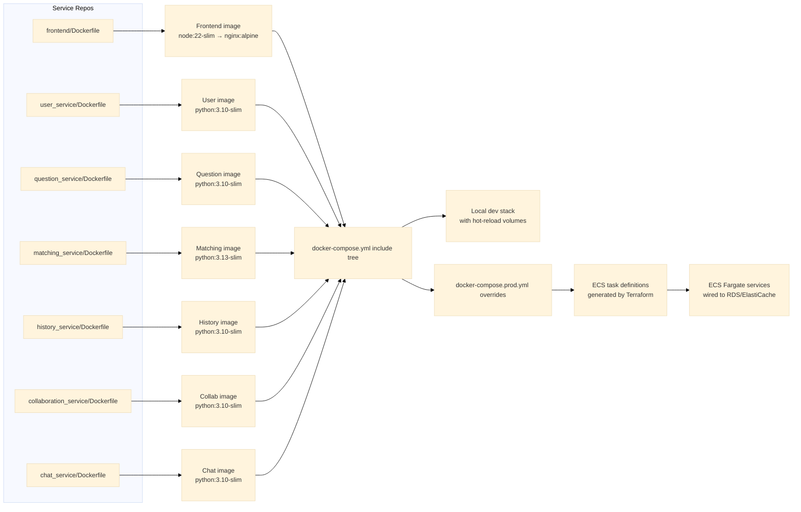
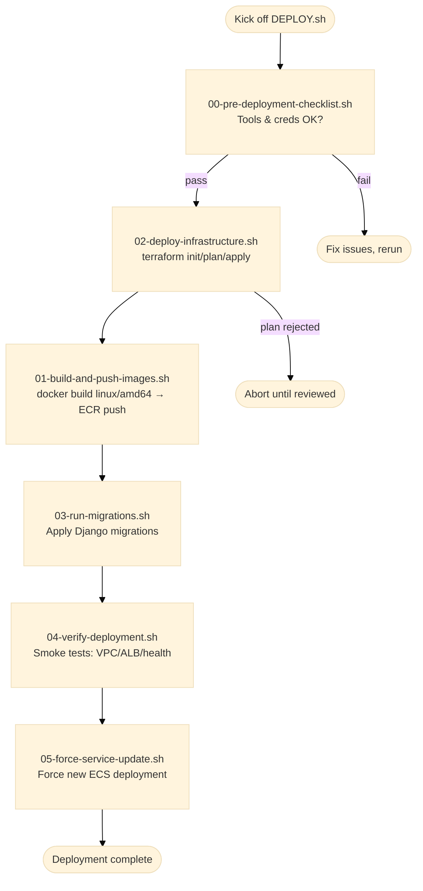
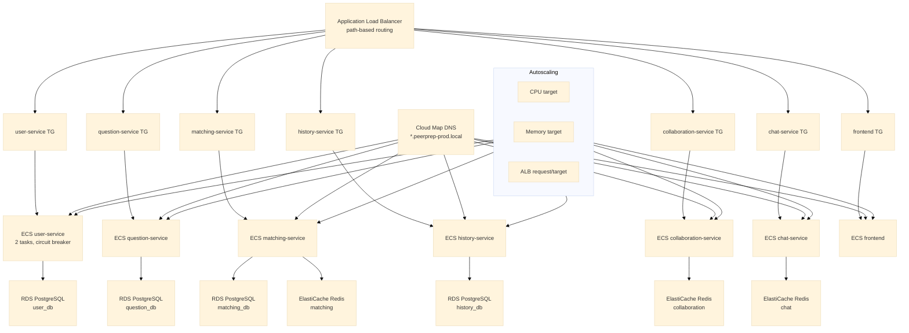
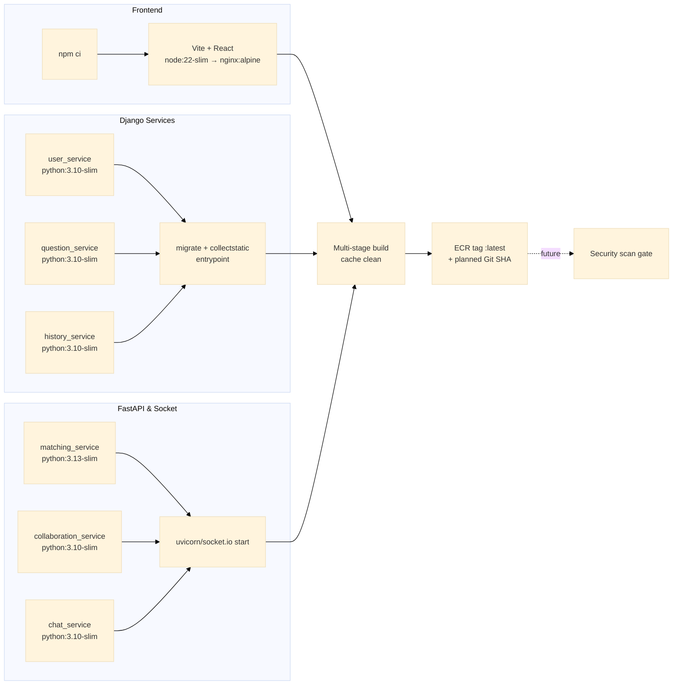
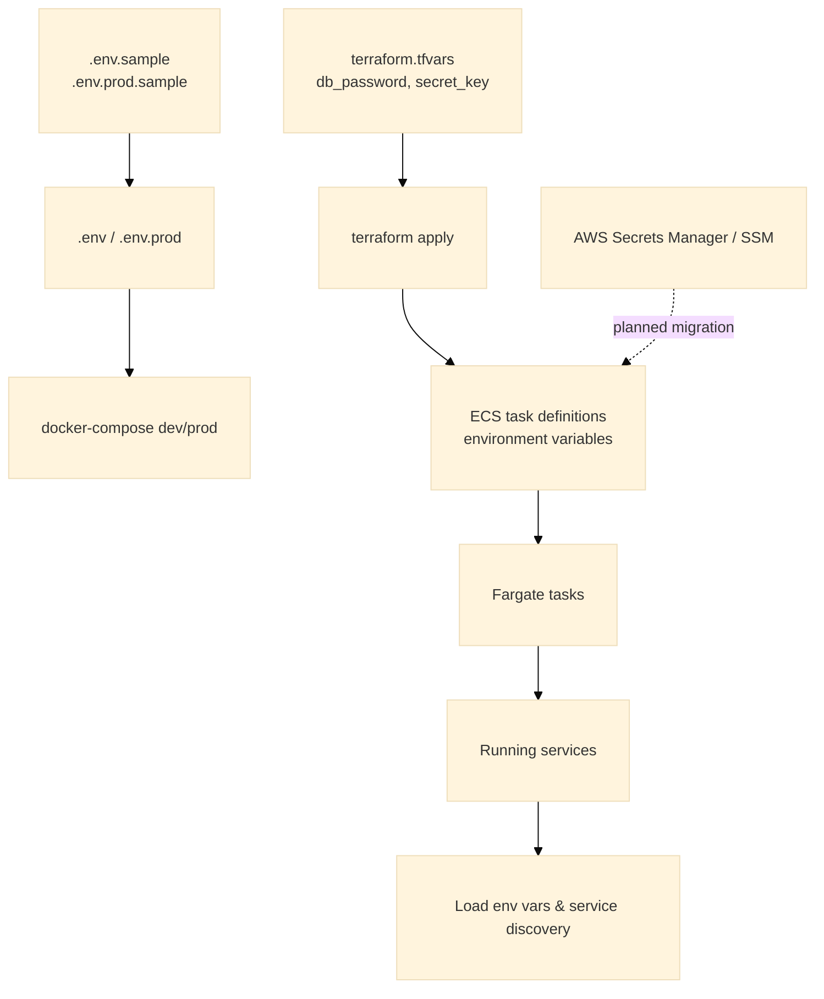
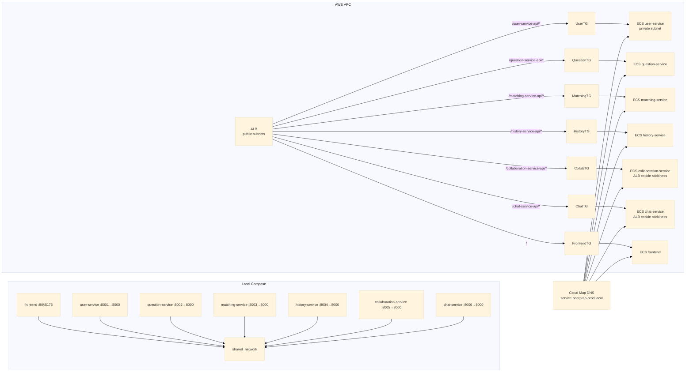
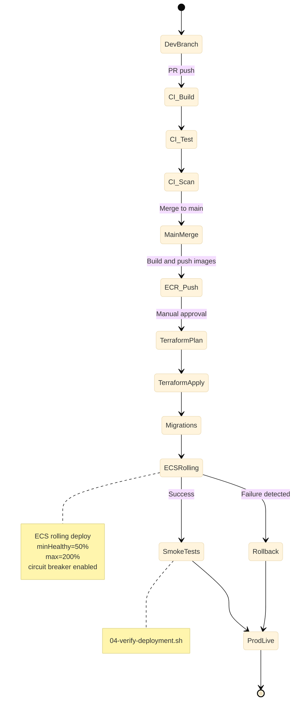
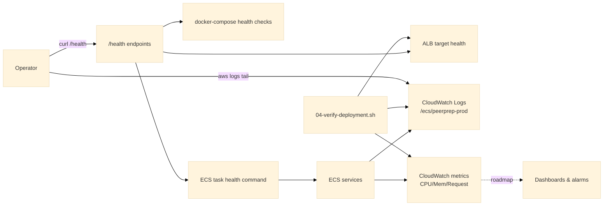

# Service Containerization (Implementation & Deployment Decisions)

Some of these decisions depend on the chosen nice-to-have categories, but the current plan already covers the must-have scope below.

## Chosen Approach to Containerize Must-Have Services

All seven must-have services (frontend, user, question, matching, history, collaboration, chat) keep a dedicated Dockerfile and standalone `docker-compose.yml`. The root-level `docker-compose.yml` simply includes each sub-service so local developers can spin up the entire stack, while `docker-compose.prod.yml` removes the local Postgres/Redis sidecars and expects Terraform-managed RDS/ElastiCache instead. Backends use slim Python bases with an entrypoint that blocks on dependencies, runs migrations, and exposes `/health`. The frontend builds under Node 22 and serves static assets out of an Nginx stage.

## Deployment Workflow and CI/CD Considerations

Operators follow scripted steps today: validate prerequisites, deploy infrastructure, build and push ECR images, run migrations, verify the stack, and optionally force ECS to refresh tasks. `DEPLOY.sh` chains those scripts; the next increment is to encode the same stages inside GitHub Actions so build » test » scan » push is gated automatically before a Terraform apply and production deploy.

## Alignment with Scalability and Production Readiness

Terraform provisions an ECS Fargate cluster, Cloud Map service discovery, an ALB with path-based routing, and autoscaling policies anchored on CPU, memory, and ALB request counts. Each must-have service defaults to two tasks, leaves 50% of capacity healthy during deploys (max 200%), and uses ECS’ deployment circuit breaker so failed rollouts revert automatically. Managed RDS/Redis back the stateful pieces, while compose parity ensures dev/prod behavior matches.

## Implementation Tech Stack

Backends run Django (user/question/history) or FastAPI/Socket.IO (matching/collaboration/chat) on slim Python images and install dependencies via `pip`; the frontend builds with Vite under Node 22, then serves static assets through Nginx with runtime `envsubst`. `01-build-and-push-images.sh` enforces `--platform linux/amd64`, clears caches, and tags both local and ECR images. Image/security scanning is currently manual—adding Trivy or ECR scans plus Git SHA tags is the next increment.

## Configuration and Secrets

Local developers copy `.env.sample`/`.env.prod.sample` into `.env`/`.env.prod`, which docker-compose reads. Terraform consumes `terraform.tfvars` (holding non-committed values like `db_password`, `secret_key`) and injects them into ECS task definitions as environment variables. `ENVIRONMENT_VARIABLES.md` documents the full matrix. Secrets live in Terraform variables for now; the ECS execution role already has `secretsmanager:GetSecretValue`, so we can later migrate to AWS Secrets Manager/SSM via the module’s `secrets` field.

## Networking and Ingress

Compose attaches every container to a shared bridge network plus service-specific networks for their databases/Redis (only necessary ports exposed). In AWS, Terraform builds VPC subnets, an ALB with path-based listener rules, and Cloud Map DNS so backend services call each other via `<service>.peerprep-prod.local`. The frontend Nginx template proxies the `/something-service-api` paths to the internal hostnames, and WebSocket workloads use ALB cookie stickiness.

## CI/CD and Rollout Strategy

The documented flow covers build → migrate → verify. When scripts run manually, Terraform plan/apply pauses for approval, then ECS performs rolling updates (min healthy 50%, max 200%) with the circuit breaker enabled. `05-force-service-update.sh` can trigger a new deployment after fresh images land. Automating the same sequence inside CI/CD will let us gate dev → staging → prod promotions behind automated tests and change approvals.

## Observability, Health Checks, and Alerts

`ADD_HEALTH_ENDPOINTS.md` describes the `/health` endpoints every service should expose. Those endpoints power docker-compose health checks, ALB target group probes, and ECS task health commands. Logs flow into CloudWatch (`/ecs/peerprep-prod`) with Container Insights enabled. `04-verify-deployment.sh` performs post-deploy smoke tests; operators can tail logs or curl `/health` through the ALB. Next steps are to harden automated health dashboards and alerting on CPU/memory/request metrics, and layer in structured logging or tracing once service-level objectives are defined.

