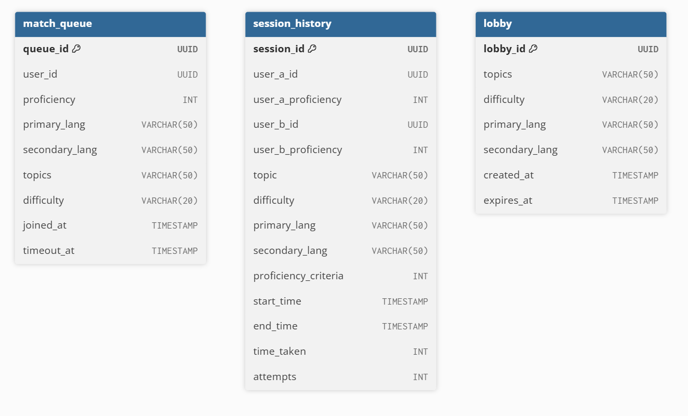

# Matching Service Specifications
> M2: Matching Service – responsible for matching users based on some reasonable criteria (e.g., topics and difficulty level of questions, proficiency level of the users, etc.) This service can potentially be developed by offering multiple matching criteria.

The matching service is responsible for matching users based on the below defined criteria:
1. Topic selection (multiselect)
1. Difficulty selection (multiselect): Easy, Medium, Hard (or as defined by Question Service)
1. Language preference (One primary language, *up to* two secondary language)
1. Proficiency level (within +-10%)

## Implementation Options for Matching
1. Simple database-based queue
    - Pros: Simple implementation, minimal techstack
    - Cons: Requires interval polling by other services to confirm a match, not truly real-time, high frequency, dependent on polling interval
1. Event-driven architecture via message broker
    - Pros: Fit for microservice, scalable, reliable, real-time, loose coupling
    - Cons: Complex implementation, slightly higher latency compared to WebSockets
1. WebSockets
    - Pros: Lowest latency, no need for broker/middleware
    - Cons: Increased coupling between services

## Database Tables

### DDL

```sql
-- Users in the matching queue
CREATE TABLE match_queue (
    queue_id UUID PRIMARY KEY DEFAULT gen_random_uuid(),
    user_id UUID NOT NULL,
    proficiency INT NOT NULL,
    primary_lang VARCHAR(50),
    secondary_lang VARCHAR(50)[],  -- array of languages
    topics VARCHAR(50)[],           -- array of topics
    difficulty VARCHAR(20)[],       -- array of difficulties (easy/medium/hard)
    joined_at TIMESTAMP NOT NULL DEFAULT NOW(),
    timeout_at TIMESTAMP NOT NULL   -- calculated as joined_at + 60 seconds
);

-- Store session history
CREATE TABLE session_history (
    session_id UUID PRIMARY KEY DEFAULT gen_random_uuid(),
    user_a_id UUID NOT NULL,
    user_a_proficiency INT NOT NULL,
    user_b_id UUID NOT NULL,
    user_b_proficiency INT NOT NULL,
    topic VARCHAR(50) NOT NULL,
    difficulty VARCHAR(20) NOT NULL,
    primary_lang VARCHAR(50),
    secondary_lang VARCHAR(50),
    proficiency_criteria INT,
    start_time TIMESTAMP NOT NULL,
    end_time TIMESTAMP NOT NULL,
    time_taken INT,    -- seconds
    attempts INT
);

-- Lobbies for users waiting
CREATE TABLE lobby (
    lobby_id UUID PRIMARY KEY DEFAULT gen_random_uuid(),
    topics VARCHAR(50)[],            -- array of topics
    difficulty VARCHAR(20)[],        -- array of difficulties
    primary_lang VARCHAR(50),
    secondary_lang VARCHAR(50)[],    -- array of languages
    created_at TIMESTAMP NOT NULL DEFAULT NOW(),
    expires_at TIMESTAMP              -- optional timeout for lobby
);
```

### Entity Relationship Diagram


## Matching Service API Endpoints

### Basic matching
- `POST /api/match` - Adds the user to the matching queue with the given criteria
    - Used by: Frontend - Matching page
    - Input: (as request body)
        ```python
        {
            user_id: UUID,
            topics: list[Topic] = [], # empty list implies all topics
            difficulty: list[Difficulty] = [], # empty list implies all difficulty
            primary_lang: list[Language] = [], # empty list implies no language preference
            secondary_lang: list[Language] = [], # empty list implies no language preference
            proficiency: int
        }
        ```
    - Response:
        - `201 Created`: User successfully added into queue - returns queue id
        - `400 Bad Request`: Invalid/Malformed input
        - `409 Conflict`: User already in queue
    - Output/Response body:
        ```python
        {
            status: Status,
            queue_id: UUID,
            timeout: int
        }
        ```
    - Possible pushed events:
        - UserMatched event:
            ```python
            {
                user_a: {id: UUID, proficiency: int},
                user_b: {id: UUID, proficiency: int},
                topic: Topic,
                difficulty: Difficulty,
                language: Language
            }
            ```
        - Timeout event
- `GET /api/match` - Checks the matching status of the user (Only if polling driven approach is used)
    - Used by: Frontend - Finding match page
    - Input:
        - `user_id: UUID **or** queue_id: UUID (up for discussion)`
    - Response:
        - `200 OK`: Returns the matching status of the user
        - `400 Bad Request`: Invalid/Malformed input
        - `404 Not Found`: User not in queue
    - Output/Response body:
        - `{ status: Status, time_remaining: int }`
- `DELETE /api/match` - Removes the user from the matching queue
    - Used by: Frontend - Finding match page - Cancel button
    - Input:
        - `user_id: UUID **or** queue_id: UUID (up for discussion)`
    - Response:
        - `200 OK`: User successfully removed from queue
        - `400 Bad Request`: Invalid/Malformed input
        - `404 Not Found`: User not in queue

### Session history
- `POST /api/session` - Stores session history
    - Used by: Collaboration service - End of session
    - Input:
        ```python
        {
            session_id: UUID,
            user_a: {
                "id": UUID,
                "proficiency": int
            },
            user_b: {
                "id": UUID,
                "proficiency": int
            },
            "topic": Topic,
            "difficulty": Difficulty,
            "primary_lang": Language,
            "secondary_lang": Language,
            "proficiency_criteria": int,
            "start_time": str, # ISO datetime string
            "end_time": str, # ISO datetime string
            "time_taken": int, # in seconds
            "attempts": int # number of attempts before successfully passing the question
        }
        ```
    - Response:
        - `201 Created`: Session successfully stored
        - `400 Bad Request`: Invalid or missing data
- `GET /api/session` - Retrieves user's session history
    - Used by: User service/Frontend service
    - Input:
            - `user_id: UUID`
            - `limit: int = 20, # optional, number of recent sessions per page`
            - `offset: int = 0 # optional, pagination`
    - Response:
        - `200 OK`: Returns session history
        - `400 Bad Request`: Invalid/Malformed input
        - `404 Not Found`: No sessions found for user
    - Output/Response body:
        ```python
        {
            user_id: UUID,
            sessions: [
                {
                    session_id: UUID,
                    user_a: {"id": UUID, "proficiency": int},
                    user_b: {"id": UUID, "proficiency": int},
                    topic: Topic,
                    difficulty: Difficulty,
                    primary_lang: Language,
                    secondary_lang: Language,
                    start_time: str, # ISO datetime string
                    end_time: str, # ISO datetime string
                    time_taken: int,
                    attempts: int
                },
                ...
            ]
        }
        ```

### Lobby feature
- `GET /api/lobbies` - Retrieves available matching lobbies
    - Used by: Frontend - Finding match page
    - Input: None
    - Response:
        - `200 OK` - Returns list of lobbies
        - `400 Bad Request` - Invalid/Malformed input
    - Output/Response body:
        ```python
        {
            lobbies: [
                {
                    lobby_id: UUID,
                    topic: list[Topic],
                    difficulty: list[Difficulty],
                    primary_lang: Language | None,
                    secondary_lang: list[Language],
                    time_remaining: int # in seconds
                },
                ...
            ]
        }

        ```
